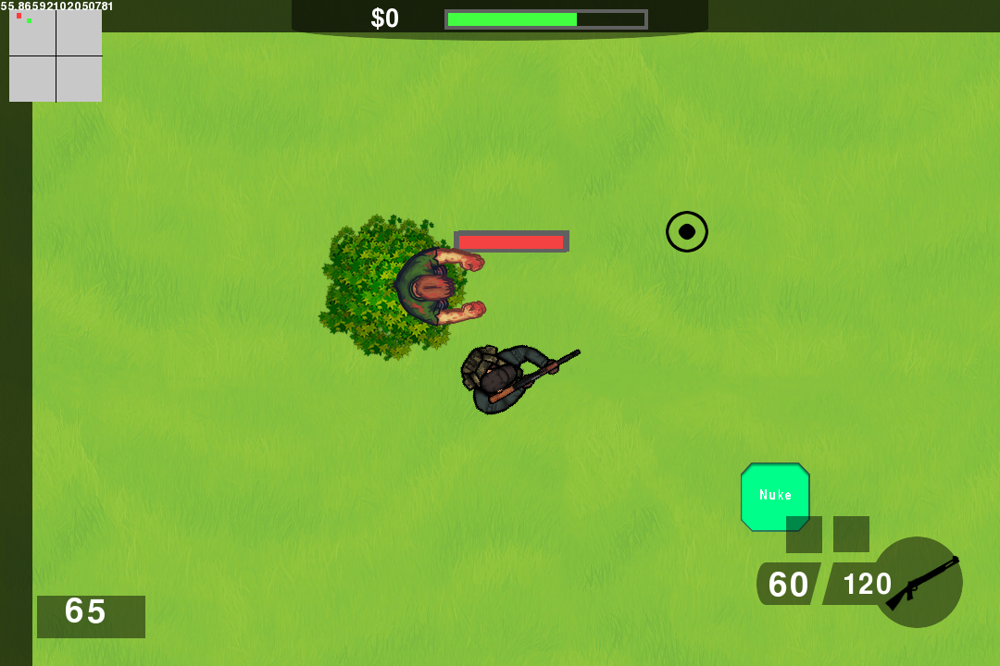

# Top-Down Shooter

A top-down zombie wave shooter built with pygame. Survive escalating waves,
spend the cash the horde drops, and don't let them surround you.



## Requirements

- Python 3.10 or newer
- `pygame-ce` (installed by the steps below — **not** upstream `pygame`, see
  [Why pygame-ce](#why-pygame-ce))

## Install

```bash
git clone https://github.com/palu3492/top-down-shooter-game.git
cd top-down-shooter-game
python -m venv .venv
.venv/bin/pip install -r requirements.txt
```

On Windows the last two lines are `py -m venv .venv` and
`.venv\Scripts\pip install -r requirements.txt`.

## Run

```bash
.venv/bin/python main.py
```

> **Run from the repository root.** Assets are currently loaded through paths
> relative to the working directory, so launching from anywhere else fails with
> a `FileNotFoundError`. AT3 makes asset paths package-relative and removes this
> restriction.

## Controls

| Input | Action |
|---|---|
| `W` `A` `S` `D` | Move |
| Mouse | Aim |
| Left click | Shoot |
| `R` | Reload |
| `G` | Throw frag grenade (5 to start) |
| `F` | Throw stun grenade (5 to start) |
| `Space` | Skip the between-wave timer and start the next wave |
| `\` | Toggle fullscreen |
| `P` | Quit |

Each wave spawns `5 + wave²` zombies. Kills pay $50. Health regenerates slowly
while you stay untouched.

## Why pygame-ce

`pip install pygame` **fails on current Python versions** — upstream publishes
no wheel for CPython 3.14 and the fallback source build errors out.

[`pygame-ce`](https://pyga.me) ("community edition") is an API-compatible fork
of pygame that ships wheels for new CPython releases much faster. It still
imports as `pygame`, so **no source changes are required** — every `import
pygame` in this repo works unmodified.

Verified here on CPython 3.14.4 with pygame-ce 2.5.8 (SDL 2.32.10).

Do not install both: they provide the same `pygame` import name and will
shadow each other. If you have upstream pygame in your environment already,
`pip uninstall pygame` before installing the requirements.

## Development

```bash
.venv/bin/pip install -r requirements-dev.txt   # adds ruff + pytest
.venv/bin/pip install -e .                      # editable install
```

An editable install also provides a `shooter` console script, subject to the
same run-from-the-repo-root caveat above.

Lint, formatting, type-checking, CI, and the test suite are not wired up yet —
they land in AT10 and AT11.

## Project layout

```
main.py                      entry point
shooter/
  game.py                    main loop, collision helpers
  background.py              scrolling background sheet
  entities/
    player.py                the survivor
    zombie.py                enemy spawning, pathing, health
    projectiles.py           bullets, grenades, explosions
    powerups.py              pickups
  ui/
    hud.py                   HUD, health bar, ammo, cash
    radar.py                 minimap
  systems/
    waves.py                 wave timing and scaling
Assets/                      images and sounds
```

## Modernization backlog

This is an eight-year-old codebase being brought forward in reviewable slices.
See [AARON_TICKETS.md](AARON_TICKETS.md) for the plan — tickets are identified
`AT<N>` and each one is a single PR against `dev`.

There are known bugs still in the backlog, including a crash: a power-up left
on the field for ~7 seconds loads a missing `Human.png` and takes the process
down (AT4).
